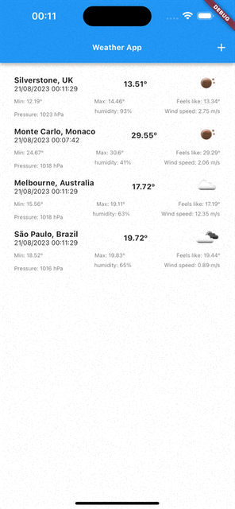

# CHANGELOG

## 0.1.0

- Tela incial com os principais locais pré-cadastrados e exibindo o clima de cada um
- Atualiza a lista ao puxar a tela para baixo
- Possibilidade de excluir localidades da lista
- Exibir previsões futuras para o local selecionado ao clicar em um item da lista

## 0.2.0

- Possibilidade de adicionar novas localidades
- Testes unitários

## 0.3.0

- Possibilidade de filtrar localidades
- Verifica se esta conectado antes de tentar atualizar a lista inicial

